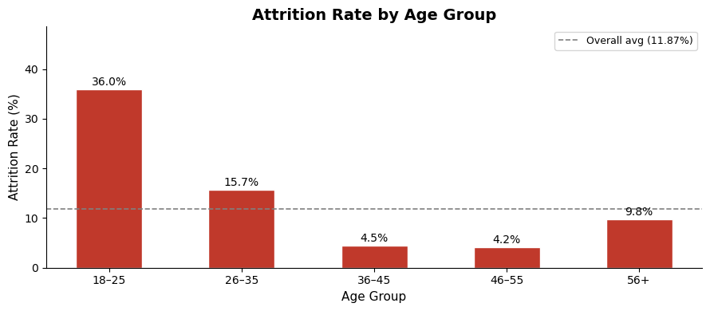
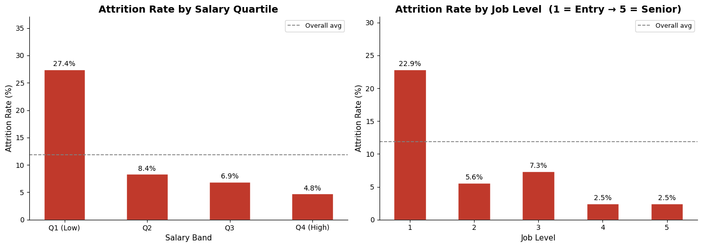
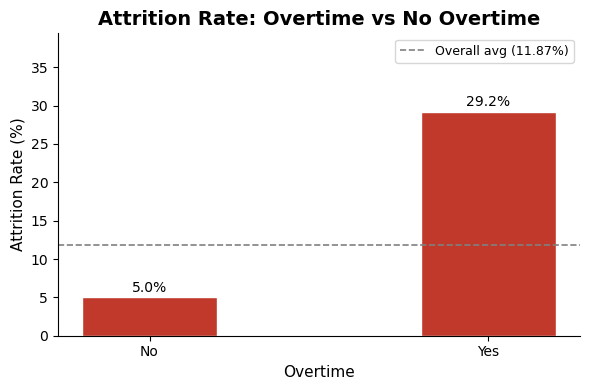
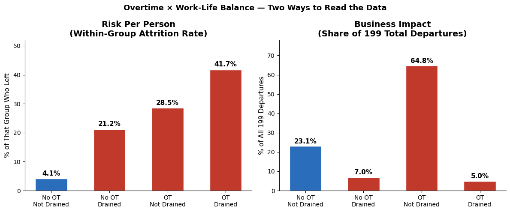
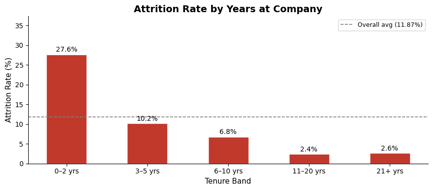

  
    
  <h1>Employee Attrition Analysis</h1>
  
<strong>Watson Healthcare Organization &nbsp;|&nbsp; 1,676 Employees &nbsp;|&nbsp; Three Departments</strong>

---

## Background

Watson Healthcare Organization operates three clinical departments — Cardiology, Maternity, and Neurology. Like most mid-size healthcare systems, Watson faces a persistent retention problem: annual turnover that drains institutional knowledge, increases recruitment costs, and puts additional pressure on the staff who stay. Leadership commissioned this analysis to identify the structural factors behind departure decisions — not symptoms, but root causes.

The central question: **who is leaving, and why?**

---

## Executive Summary

Watson Healthcare lost 199 employees in the measured period — **12% of its 1,676-person workforce**. At an estimated $60,000 per departure, that translates to $11.9 million in avoidable annual cost. The data points to three structural causes: overtime load, entry-level compensation, and the early-tenure experience. Each is addressable with policy decisions already within leadership's reach.

The analysis surfaces a consistent employee profile behind the departures: **young, underpaid, working overtime, and in their first two years**. When all three conditions are present, attrition hits 55% — nearly five times the company average.

<noscript></noscript><object class='tableauViz'  style='display:none;'><param name='host_url' value='https%3A%2F%2Fpublic.tableau.com%2F' /> <param name='embed_code_version' value='3' /> <param name='site_root' value='' /><param name='name' value='EmployeeAttrition_17799308935310&#47;AttritionAnalysis' /><param name='tabs' value='no' /><param name='toolbar' value='yes' /><param name='static_image' value='https:&#47;&#47;public.tableau.com&#47;static&#47;images&#47;Em&#47;EmployeeAttrition_17799308935310&#47;AttritionAnalysis&#47;1.png' /> <param name='animate_transition' value='yes' /><param name='display_static_image' value='yes' /><param name='display_spinner' value='yes' /><param name='display_overlay' value='yes' /><param name='display_count' value='yes' /><param name='language' value='en-US' /></object>
            

> 📊 **[View the interactive Tableau dashboard →](#) https://public.tableau.com/views/EmployeeAttrition_17799308935310/AttritionAnalysis?:language=en-US&:sid=&:redirect=auth&:display_count=n&:origin=viz_share_link

---

## The Business Problem

Watson's 12% attrition rate is not evenly distributed. It is concentrated in specific departments, specific pay bands, and specific workload conditions. That concentration matters because it means the problem is not random — it is structural, and therefore fixable.

| Department | Employees | Attrition Rate | Departures |
|------------|-----------|----------------|------------|
| Cardiology | 489 | **14%** | ~68 |
| Maternity | 633 | 12% | ~76 |
| Neurology | 554 | **8%** | ~43 |

Cardiology loses staff at nearly double the rate of Neurology. The gap is not explained by pay or seniority alone — it is compounded by shift design and workload distribution. Nurses, the largest role group at 822 employees, account for **54% of all departures** at a 13% rate.

- **Business implication:** The cost of doing nothing is not 12% — it is Cardiology cycling through a portion of its clinical workforce every few years. That has a direct impact on patient care continuity.

---

## Who Is Leaving?

Before looking at drivers, the baseline picture is important.

<!--  -->

| Age Band | Attrition Rate | Share of All Departures |
|----------|----------------|-------------------------|
| 18–25 | 36% | ~22% |
| 26–35 | ~17% | ~58% |
| 36–45 | ~8% | ~16% |
| 46–55 | ~5% | ~4% |
| 56+ | ~4% | ~1% |

**80% of all departures come from employees under 35.** The 18–25 band alone leaves at 36% — three times the company average. Average age of leavers is 31; stayers average 38.

Gender showed a small gap (Female 13% vs Male 11%) not large enough to be meaningful. Education level showed no consistent pattern — a Doctor-level employee left at under 2% while other levels clustered between 10–14% with no clear gradient.

- **Business implication:** This is an early-career retention problem. The staff Watson is investing in training and onboarding are the same staff most likely to leave before that investment pays off.

---

## What Is Driving Departures?

### Compensation — The Lowest-Paid Quarter Leaves at 6× the Rate of the Highest

The income gap between leavers and stayers is one of the clearest signals in the dataset.

- **Median monthly income, leavers: $2,741**
- **Median monthly income, stayers: $5,204**
- That is a 90% gap — not a rounding error.

<!--  -->

| Salary Band | Monthly Income | Attrition Rate |
|-------------|----------------|----------------|
| Q1 — bottom 25% | Under $2,926 | **27%** |
| Q2 | $2,926–$4,919 | 12% |
| Q3 | $4,919–$8,381 | 9% |
| Q4 — top 25% | Over $8,381 | 5% |

Job level mirrors the same pattern with no exception:

| Job Level | Attrition Rate |
|-----------|----------------|
| Level 1 (entry) | **23%** |
| Level 2 | 15% |
| Level 3 | 8% |
| Levels 4–5 (senior) | 3% |

> **Business implication:** Entry-level employees earning under $2,926/month leave at nearly the same rate as the worst-performing overtime segment. The $2,463 median income gap between leavers and stayers is large enough to drive a decision, not just create dissatisfaction. Closing even half of that gap for Q1 earners would materially reduce the 55 departures per year that cohort generates.

---

### Overtime — The Strongest Single Signal in the Dataset

Overtime is the highest-impact binary variable in this analysis. No single factor produces a wider attrition gap.

<!--  -->

| Overtime Status | Attrition Rate | Share of All Departures | % of Workforce |
|----------------|----------------|-------------------------|----------------|
| No overtime | 5% | 30% | 72% |
| Yes overtime | **29%** | **70%** | 28% |

Overtime workers are **28% of the workforce but 70% of everyone who leaves**. That over-representation ratio (2.45×) is the largest of any segment in the dataset.

Work-life balance was also examined. Employees rated "Drained" (level 1) leave at 27%, but the volume finding matters most: **65% of all departures come from overtime workers who are not even flagged as burned out**. The risk is not limited to extreme cases.

<!--  -->

| Segment | Attrition Rate | Share of Departures |
|---------|----------------|---------------------|
| No OT — Not Drained | 4% | 23% |
| No OT — Drained | 21% | 7% |
| OT — Not Drained | **29%** | **65%** |
| OT — Drained | 42% | 5% |

- **Business implication:** The 452 overtime workers who are not flagged as drained still leave at 29%. Waiting for visible burnout to intervene is too late. Overtime exposure alone is the trigger.

---

### Work Conditions — Distance, Satisfaction, and Training

Three secondary factors add texture but are not primary drivers:

- **Distance from home:** Employees commuting 21–29 miles leave at 20% vs 9% for those within 5 miles. Leavers average 11.6 miles vs stayers at 8.9.
- **Job satisfaction:** Low satisfaction = 16% attrition vs 9% at the highest level. A real gradient, but satisfaction often reflects the primary drivers rather than causing departures independently.
- **Training:** 0 sessions in the last year = 21% attrition — the highest non-OT risk flag outside of compensation. Employees who receive no training at all read it as a signal they are not worth investing in.

- **Business implication:** Distance and satisfaction are hard to intervene on directly. Zero training, however, is a correctable behavior — and it functions as an early warning flag for disengaged employees who are already at elevated risk.

---

### Career Progression — Stagnation Sets In Earlier Than Expected

<!--  -->

| Tenure Band | Attrition Rate |
|-------------|----------------|
| 0–2 yrs | **28%** |
| 3–5 yrs | 10% |
| 6–10 yrs | 7% |
| 11–20 yrs | 2% |
| 21+ yrs | 3% |

Attrition drops sharply after year two and nearly disappears after year five. The early-tenure window is not just a risk period — it is the risk period.

Time in current role shows the same pattern:

| Years in Current Role | Attrition Rate |
|-----------------------|----------------|
| 0–2 yrs | **19%** |
| 3–5 yrs | 7% |
| 6–10 yrs | 5% |
| 11+ yrs | 1% |

Manager stability compounds this further. Employees with less than one year under their current manager leave at **25%**. The combination of a new role, a new manager, and no clear progression path creates a situation where employees have no institutional reason to stay.

- **Business implication:** Career stagnation is not a long-tenure problem. It starts in year one. Employees who cannot see a path forward in their first two years make the decision to leave before anyone notices they are at risk.

---

## The Profile Behind 55% Attrition

The three drivers above are not independent. When they combine, the risk is not additive — it compounds.

<!--  -->

| Segment | Attrition Rate | Share of Departures | n |
|---------|----------------|---------------------|---|
| 0–2 yrs + Overtime | **55%** | 33% | 118 |
| 0–2 yrs, No Overtime | 16% | 21% | 269 |
| 3+ yrs + Overtime | 21% | 37% | 358 |
| 3+ yrs, No Overtime | 2% | 9% | 931 |

Overtime is distributed evenly across tenure groups — new hires are not being assigned more OT than experienced staff. But they cannot absorb it the same way. A 3+ year employee on overtime leaves at 21%. A new hire on overtime leaves at **55% — 2.6× higher**. Tenure is a buffer. New employees do not have it yet.

**The full profile of the highest-risk employee:**

| Attribute | Value |
|-----------|-------|
| Age | Under 35 |
| Salary band | Q1 — under $2,926/mo |
| Overtime | Yes |
| Tenure | 0–2 years |
| Job Level | 1 (entry) |
| Department | Cardiology or Maternity |

This is not a hypothetical edge case. It describes a meaningful share of Watson's clinical workforce, particularly among entry-level nurses in Cardiology. The 0–2 year cohort alone accounts for **54% of all departures** while representing just 23% of staff.

---

## Three Targeted Recommendations

Each recommendation maps directly to one of the three structural drivers.

### 1 — Cap Overtime for Employees in Their First 12 Months

- *Targets: Tenure × OT finding. Est. impact: ~40 fewer departures/year if OT coverage drops from 28% → 15% of staff.*

New hires on overtime leave at 55%. That rate does not require burnout to materialize — it applies even to employees who are not flagged as drained. Protecting the first year from unplanned overtime reduces the highest-rate segment in the dataset.

**How:**
- Set a department-level threshold: no more than 15% of staff on overtime in any given period
- Flag employees at 3+ consecutive OT periods for manager review before it becomes a pattern
- Pilot in Cardiology first — highest rate, highest volume

---

### 2 — Raise Entry-Level Pay Floors

- *Targets: Salary Q1 / Job Level 1. Est. impact: Q1 cohort generates ~55 departures/year at the current 27% rate.*

The $2,463 median income gap between leavers and stayers is large enough to be a primary driver, not just a dissatisfaction signal. Closing that gap partially for the lowest-paid employees addresses the single clearest compensation signal in the data.

**How:**
- Benchmark Q1 salaries against regional healthcare competitors — minimum target: $3,800/mo
- Prioritize Cardiology and Maternity nurses in Level 1 roles
- Pair compensation changes with transparent promotion timelines to address stagnation alongside pay

---

### 3 — Build a First-Year Retention Program

- *Targets: Early tenure + manager tenure signal. Goal: move the 0–2yr attrition rate from 28% toward the 10% seen at 3–5 yrs.*

The first two years are where Watson loses the most people, and it is the window where early intervention has the highest leverage. Structured touchpoints give the organization a chance to identify at-risk employees before they have already made the decision to leave.

**How:**
- Structured check-ins at 30, 90, and 180 days for all new hires — manager and HR touchpoints
- Assign stable managers to new employees for at least 12 months (< 1 yr with same manager = 25% attrition)
- Define a visible role roadmap: what does progression look like at year 1, 2, and 3?
- Zero training = 21% attrition — flag employees who have not received any training within 6 months

---

## Putting It Together

Watson does not have a broad attrition problem. It has a concentrated one. Three conditions — overtime exposure, below-market entry pay, and the first-year experience — account for the overwhelming majority of a $3–5M annual cost. None of them require new technology or additional headcount. They require decisions about how new employees are scheduled, paid, and supported in their first year.

The data makes the cost of inaction clear. The profile of who is leaving is specific enough to act on.

---

## Dataset

| Field | Detail |
|-------|--------|
| Source | Watson HR Analytics (Healthcare variant) |
| File | `watson_healthcare_modified2.csv` |
| Rows | 1,676 employees |
| Columns | 32 (3 constant columns dropped: EmployeeCount, Over18, StandardHours) |
| Target variable | `Attrition` — Yes / No (12% overall, 199 of 1,676) |

**Derived columns added during analysis:**
`AgeGroup`, `EducationLabel`, `JobSatLabel`, `WLBLabel`, `DistanceBand`, `SalaryBand`, `TenureBand`, `PromoBand`, `RoleBand`, `MgrBand`, `OT_WLB_Segment`, `TenureOT`

---

## Project Files

| File | Description |
|------|-------------|
| `healthcare_churn.ipynb` | Full analysis notebook — 6 phases, all findings |
| `watson_healthcare_modified2.csv` | Source dataset |
| `watson_attrition_deck.pptx` | Stakeholder slide deck (9 slides) |

## Tools

- **Python** — pandas, matplotlib, seaborn
- **Tableau** — interactive dashboard
- **PowerPoint** — stakeholder deck

